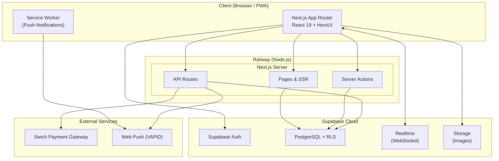
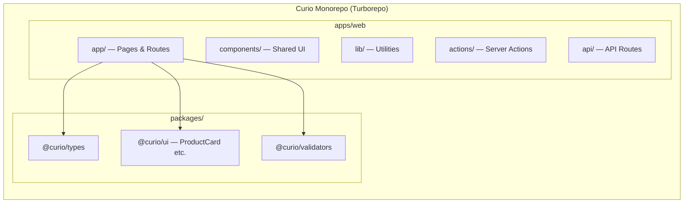
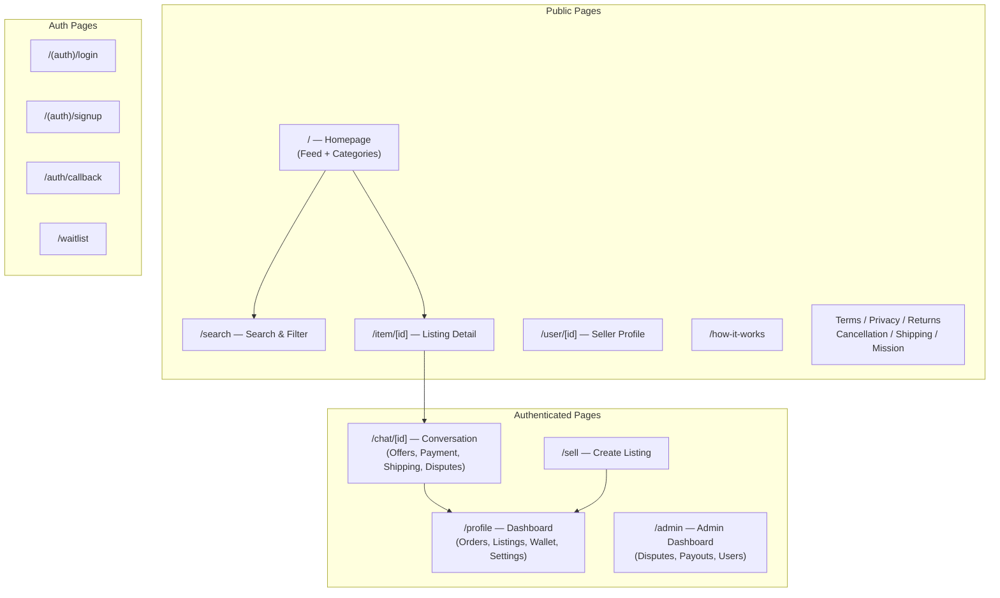
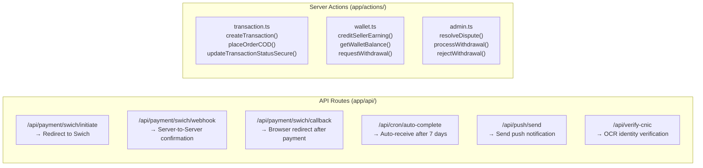
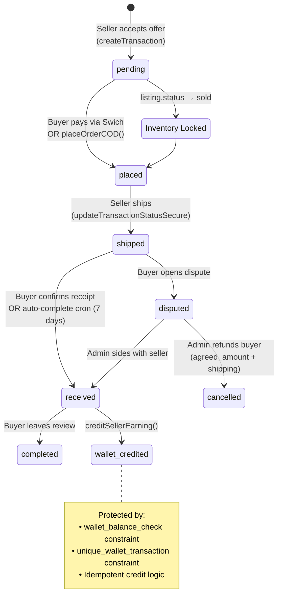
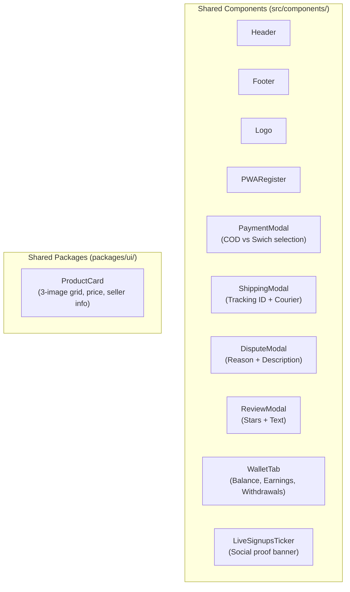
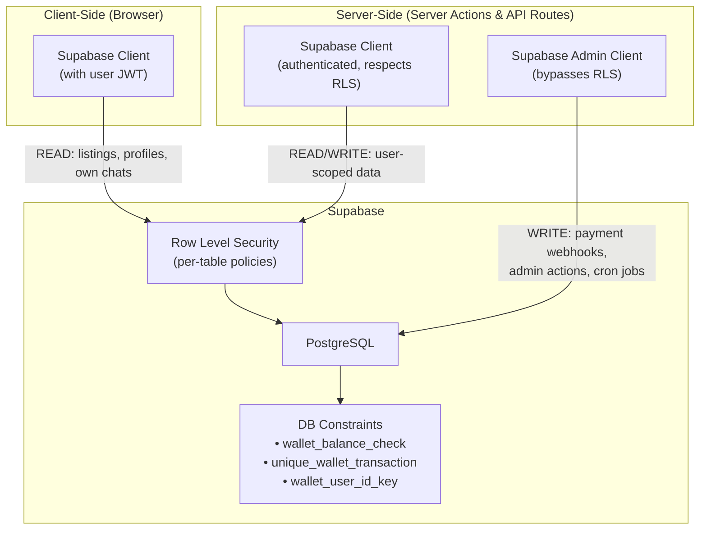
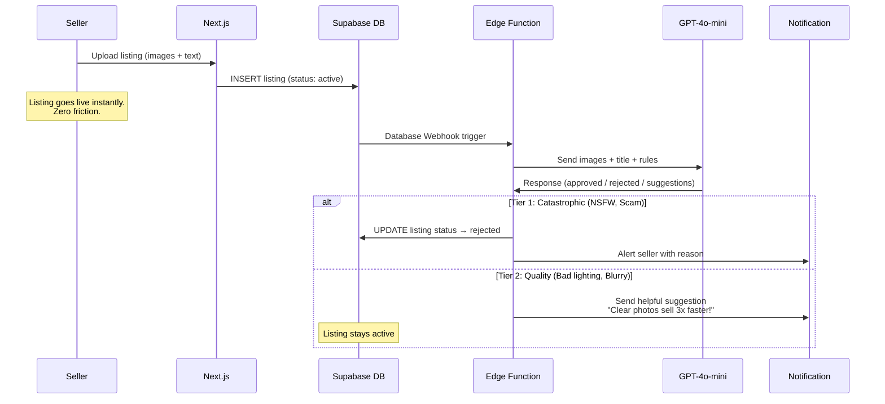

# Curio — System Architecture Diagram

## High-Level Overview

---

## Monorepo Structure

---

## Page Map

---

## API Routes & Server Actions

---

## Payment & Transaction Lifecycle

---

## Components Map

---

## Data Flow: Supabase Security Model

---

## Proposed: AI Moderation Pipeline (Phase 4)

---

## External Service Dependencies

| Service | Purpose | Free Tier Limits |
|---|---|---|
| **Supabase** | Auth, DB, Realtime, Storage | 500MB DB, 1GB storage, 200 Realtime connections |
| **Railway** | Hosting (Next.js) | $5/mo hobby, scalable |
| **Swich** | Payment Gateway (Pakistan) | Per-transaction fees |
| **Web Push (VAPID)** | Push notifications | Unlimited (self-hosted) |
| **Tesseract.js** | CNIC OCR verification | Unlimited (client-side) |
| **Sentry** (planned) | Error tracking | 5K errors/mo free |
| **PostHog** (planned) | Product analytics | 1M events/mo free |
| **GPT-4o-mini** (planned) | Listing moderation | ~$2.50 per 1K listings |
