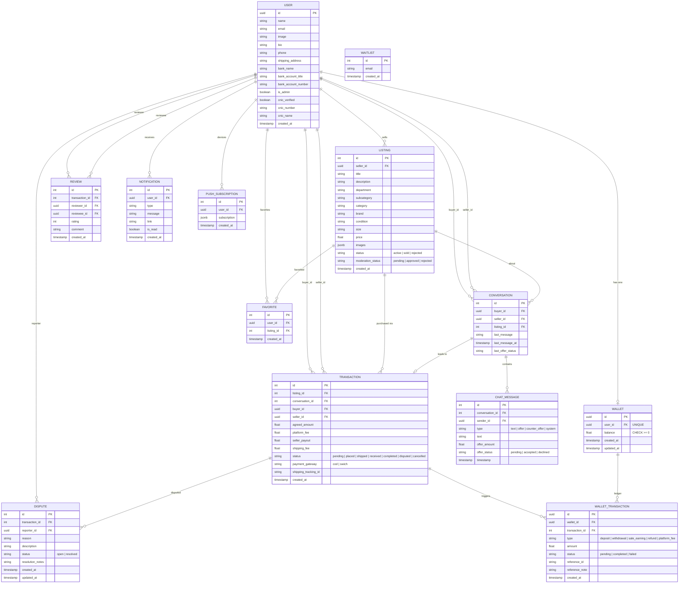
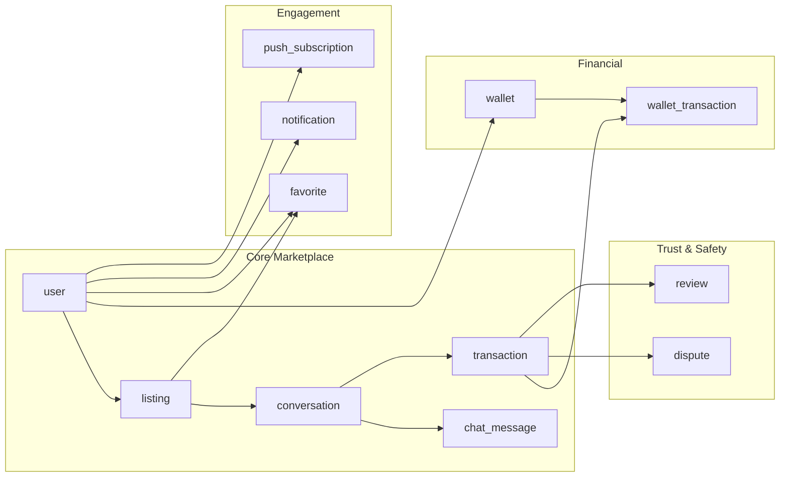

# Curio — Database Entity-Relationship Diagram

> Reverse-engineered from every `.from()`, `.select()`, and `.insert()` call in the codebase.

## Full ER Diagram

---

## Views

| Name | Purpose | Columns |
|---|---|---|
| `public_user_profiles` | Public-facing user info (used in listings, conversations, reviews). Hides sensitive fields like CNIC, bank details, etc. | `id`, `name`, `email`, `image` (inferred) |

---

## Database Constraints (Verified)

| Constraint | Table | Purpose |
|---|---|---|
| `wallet_balance_check` | `wallet` | `CHECK (balance >= 0)` — prevents negative balances at the DB level |
| `wallet_user_id_key` | `wallet` | `UNIQUE (user_id)` — one wallet per user |
| `unique_wallet_transaction` | `wallet_transaction` | `UNIQUE (wallet_id, transaction_id, type)` — prevents double-crediting |
| `wallet_transaction_wallet_id_fkey` | `wallet_transaction` | FK to `wallet.id` |
| `wallet_transaction_transaction_id_fkey` | `wallet_transaction` | FK to `transaction.id` |

---

## Indexes (Recently Added)

| Index | Table | Column |
|---|---|---|
| `idx_listing_status` | `listing` | `status` |
| `idx_transaction_buyer` | `transaction` | `buyer_id` |
| `idx_transaction_seller` | `transaction` | `seller_id` |
| `idx_transaction_status` | `transaction` | `status` |
| `idx_conversation_buyer` | `conversation` | `buyer_id` |
| `idx_conversation_seller` | `conversation` | `seller_id` |
| `idx_chat_message_conversation` | `chat_message` | `conversation_id` |
| `idx_wallet_transaction_wallet` | `wallet_transaction` | `wallet_id` |
| `idx_notification_user` | `notification` | `user_id` |

---

## Relationships Summary

---

## Analysis: What's Missing

| Gap | Impact | Priority |
|---|---|---|
| **No `listing_history` or audit table** | When a listing goes from `active` → `sold` → (dispute refund) → should it go back to `active`? There's no audit trail of status changes. | Medium (for dispute resolution edge cases) |
| **No `dispute_id` on `transaction`** | When a dispute is resolved, we update the transaction status. But we can't easily find which dispute caused a cancellation without joining through `dispute.transaction_id`. A backlink would simplify admin queries. | Low |
| **`moderation_status` exists but is unused** | The sell page inserts `moderation_status: "pending"` but nothing ever reads or acts on it. This is the hook for the AI moderation pipeline we designed. | Ready for Phase 4 |
| **No `deleted_at` / soft delete** | Listings and users can only be "active" or "sold". If a user wants to delete a listing, or if admin bans a user, there's no soft delete mechanism. | Medium |
| **`public_user_profiles` view columns are inferred** | I can see the view is queried for `name` and `email` but I can't verify the exact column list without checking Supabase directly. | Low |

> [!TIP]
> The `moderation_status: "pending"` field already exists in the listing insert — the database is already prepped for the AI moderation pipeline. When we build Phase 4, we just need to write the Edge Function that reads it.
